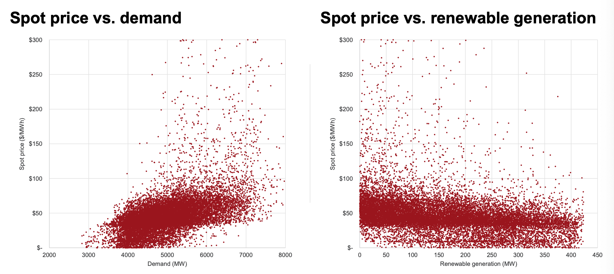

# 2021 Semester 2 Applied Data Science - Battery Optimisation Project

This battery optimisation project is a practical project for Rin (Sunchuangyu Huang) and Martin (Quizihan Wu). 
Why practical project? cause the team was doing the CSL industry project instead. 

For now on, we try to accomplish this project within couple weeks (expect in 3 weeks), see where we can go 
by comparing other group's work. 

## Table of Content

- [Project Specs](#project-specs)
    - [Problem Overview](#problem-overview)
        - [Without battery](#without-battery)
        - [WIth battery](#with-battery)
        - [Objective]()
            - [Objective: Mandatory task](#objective-mandatory-task)
            - [Objective: Bonus task](#objective-bonus-task)
            - [Industry purpose: Revenue maximisation](#industry-purpose-revenue-maximisation-for)
    - [Energy context](#energy-context)
        - [Overview of Nation Electricity Market (NEM)](#overview-of-nation-electricity-market-nem)
        - [Price setting](#price-setting)
        - [Generation](#generation)
        - [Price setting in the NEM: 30-minute spot price](#price-setting-in-the-nem-30-minute-spot-price)
        - [Electricity price trends: Victorian spot price (2020)](#electricity-price-trends-victorian-spot-price-2020) 
        - [How batteries function](#how-batteries-function)
    - [Problem description](#problem-description)
        - [Problem Objective](#problem-objective)
            - [Mandatory task: The perfect but impractical battery](#mandatory-task-the-perfect-but-impractical-battery)
            - [Bonus task: The practical but imperfect battery](#bonus-task-the-practical-but-imperfect-battery)
            - [Requirments for both tasks](#requirements-for-both-tasks)
        - [Data points enabled for use at time t in the models](#data-points-enabled-for-use-at-time-t-in-the-models)
        - [Data timeline for battery calibration](#data-timeline-for-battery-calibration)
        - [Deliverables](#deliverables)
            - [Deliverable](#deliverable)
            - [Objective](#objective)
        - [Battery technical and commerical properties](#battery-technical-and-commercial-properties)
        - [Illustrative algorithms for consideration](#illustrative-algorithms-for-consideration)
        - [Data sources for problem (all sourced from AEMO)](#data-sources-for-problem-all-sourced-from-aemo)
            - [Mandatory task](#mandatory-task)
            - [Bonus task](#bonus-task)
- [Directories](#directories)
- [Summarised Information](#summarised-information)
- [Dependencies](#dependencies) 
- [Others](#others)
- [License](#license)

## Project Specs

### Problem overview

#### Without battery
- In Australia, grid electricity demand has a bath-tub shape (called the duck-curve) due to rooftop
solar on homes and commercial properties reducing the amount of electricity needed during the middle of the day.
- Additional solar generation is therefore limited in its ability to meet demand, despite having low 
capital costs and no short-run marginal cost (no fuel) - it is free to operate.

#### With battery
- Batteries add energy demand when they charge, and then add to energy supply when they discharge.
- Energy storage technologies, such as batteries, are critical for the renewable energy transition due 
to their ability to shift energy to low sunlight/wind periods.
- Note the large solar capacity (compared to without battery) due to the battery "unlocking more generation".
This displaces more expensive and high-emitting generation.

#### Objective: Mandatory task
- Develop an algorithm that determines the optimal charge and discharge behavior of a battery based 
in Victoria. -- TODO: linear program with constraints optimisation problem.
- Maximise revenues by charging when electricity prices are low and discharging when prices are high.

#### Objective: Bonus task
- Inform current charging behavior without using future prices. -- TODO: build a machine learning
model use to predict the price

#### Industry purpose: Revenue maximisation for:
- Stand-alone grid batteries.
- Residential battery aggregatores (Virtual Power Plants).
- Renewable energy developers.

### Energy context

#### Overview of Nation Electricity Market (NEM)

- Comprises 5 states (ACT is considered to be a part of NSW).
- Interconnectors between the states allow for the sharing and trading of electricity (up to certain 
specified limits).

#### Price setting

- Prices are set every 30 minutes based on prevailing supply and demand (called the spot price).
- Each state has its own price.

#### Generation

- Every generator is registerd to a single state.
- Dispatchable generators include **goal, gas, biomass and hydro**.
- Intermittent generators include **wind and solar**.
- Storage technology includes **pumped hydro and batteries**.

#### Price setting in the NEM: 30-minute spot price

As an illustrative example, consider a closed system with a 10MV (pronounced megawatt) coal generator,
at 10MV solar farm, and a 10 MV gas generator.

**The coal generator bids 5MW at $1,000**: It is prohibitively expensive to restart a coal turbine 
and causes significant wear-and-tear to run it discontinously, so coal generators tend to put their 
minimum stable volume at the market floor price to guarantee dispatch.

**The coal generator bids its remaining 5MW at $60**: The short-run marginal cost for coal is currently around
$30-$50 per MV so this ensures profitability for ramping above minimum stable levels.

**The solar farm bids all its 10MW at $1**: Solar is a price taker and has no short-run marginal cost to 
operate (no fuel required).

**The gas generator bids 5MW at $120**: The short-run marginal cost for gas is currently around $80-$120 per MV
and so this price ensures it switches on when profitable. Unlike coal, some gas turbines can switch on and off.

**The gas generator bids its remaining 5MW at $15,000**: When demand reaches extreme levels, there is no
competition and so generators can bid at the market-cap.


In this simplified example, the following settlements occur:
- In the 5-minute and 10-minute periods, demand is low and is serviced by the lowest cost generation. 
The price is $1 in both periods and this is received by both solar and coal for their respective columnes dispatched.
- In the 15-minute period, demand rises and coal ramps up to meet this. The price is set at $60 which is received by 
both coal and solar for theri respective volumes dispatched.
- In the 20-minute and 30-minute periods, demand is near its peak and gas switches on to ensure adequate supply. 
The price is set at $120 and this is received by all generators for the respective volumnes dispatched.
- In the 25-minute period, demand momentarily reaches its peak. The price is set at $15,000 and all generators receive this price for their respective generation.

**The price for the 30-minute period is set at the average of the 6 periods = ~$2,550/MWh. All generators receive this price for their generation output during the 30-minute period.**

> Generation/consumption in Megawatt-hours (MWh) = Power in Megawatts (MV) * Time in hours (h)

#### Electricity price trends: Victorian spot price (2020)


#### How batteries function

1. Battery starts with no stored charge 
2. The battery charges by consuming power from the grid
3. The battery stores energy up to but not exceeding its capacity.
4. The battery can discharge and supply power to the grid.

### Problem description

#### Problem Objective

##### Mandatory task: The perfect but impractical battery

Develop an algorithm to **maximise the revenue** of a grid connected battery assuming perfect future price 
visibility. VIC price is the only variable required for this optimisation.

##### Bonus task: The practical but imperfect battery

Develop another algorithm to maximise the revenues of a grid connected battery assuming no future visibility 
of price. The usage of renewables and demand data available at each period is allowed given the ability to 
forecast these.

##### Requirements for both tasks

- Ensure all technical and operational criteria are met
- Use the assigned Training and Cross-Validation periods to develop the algorithm
- Output revenues and battery dispatch from the Test period for comparison with other groups. -- TODO: need a comparison result 

#### Data points enabled for use at time t in the models

| Data point | Variable Name | Examples | Mandatory task | Bonus task |
| :---- | :----: | :----: | :----: | :----: |
| Prices before current period | PBCP | Price_{t-n} | Allowed | Allowed |
| Prices during current period | PDCP | Price_{t} | Allowed | Allowed |
| Prices after current period | PACP | Price_{t+n} | Allowed | Not Allowed |
| Demand/supply before period | DSBCP | Variable_{t-n} | Allowed but not required | Allowed |
| Demand/supply during period | DSDCP | Variable_{t} | Allowed but not required | Allowed |
| Demand/supply after period | DSACP | Variable_{t+n} | Allowed but not required | Allowed |

#### Data timeline for battery calibration

To ensure comparable outcomes across the groups, identical time periods should be userd for 
Training, Cross-Validation and Testing.


#### Deliverables

##### Deliverable

- [ ] How much energy is consumed in 10 minutes at 90MW? 
- [ ] What is the VIC spot price on 01/07/2020 15:00?
- [ ] What is the maximum revenue a battery can make on 17/07/2020 assuming it starts the day discharged and can only discharge 580MWh (the battery has a single charge cycle for this set)?
- [ ] Provide a proposed approach on how you will optimise revenues with your final algorithm (200 words)

#### Objective

- [ ] Demonstrate an understanding of electricity fundamentals.
- [ ] Demonstrate an understanding of the electricity data provided.
- [ ] Demonstrate an understanding of battery revenue maximisation.
- [ ] Demonstrate that solution is valid.

#### Battery technical and commerical properties

| Variable             | Unit | Value | Description | Data source |
| :---- | :----: | :----: | :----:    | :----: | 
| State                | Text | VIC   | The regional node determines the spot market pricing. | - |
| Battery power        | MW   | 300   | Maximum instantaneous rate of energy release or energy charging. | [Proposed battery for Deer Park, Melbourne](https://www.afr.com/companies/energy/transgrid-to-install-big-battery-for-melbourne-20210705-p586wv).
| Battery capacity     | MWh  | 580   | Maximum energy that can be stored in the battery at full charge. | [Proposed battery for Deer Park, Melbourne](https://www.afr.com/companies/energy/transgrid-to-install-big-battery-for-melbourne-20210705-p586wv).
| Charge efficiency    | %    | 90    | Electricity to chemical conversion rate in stored battery capacity | [Australian Energy Market](https://www.aemo.com.au/-/media/Files/Electricity/NEM/Planning_and_Forecasting/Inputs-Assumptions-Methodologies/2019/2019-Projections-for-Small-Scale-Embedded-Technologies-Report-by-CSIRO.pdf) |
| Discharge efficiency | %    | 90    | Chemial to electrical convertion rate into grid dispatch energy.   | [Australian Energy Market](https://www.aemo.com.au/-/media/Files/Electricity/NEM/Planning_and_Forecasting/Inputs-Assumptions-Methodologies/2019/2019-Projections-for-Small-Scale-Embedded-Technologies-Report-by-CSIRO.pdf) |
| Marginal Loss Factor | #    | 0.991 | Losses associated with energy transmission. | [Laverton Northas shadow connection](https://aemo.com.au/en/energy-systems/major-publications/integrated-system-plan-isp/2022-integrated-system-plan-isp/current-inputs-assumptions-and-scenarios) |
| Capital cost         | $    | 0     | Assume all development and procurement capital is sunk. | - |
| Fixed O&M | $/kW/year | 8.10 | Costs associated with fixed operations and maintenance. | [Australian Energy Market](https://www.aemo.com.au/-/media/Files/Electricity/NEM/Planning_and_Forecasting/Inputs-Assumptions-Methodologies/2019/2019-Projections-for-Small-Scale-Embedded-Technologies-Report-by-CSIRO.pdf) |
| Variable O&M | $/MWh | 0.00 | Costs associated with variable operations and maintenance. | [Australian Energy Market](https://www.aemo.com.au/-/media/Files/Electricity/NEM/Planning_and_Forecasting/Inputs-Assumptions-Methodologies/2019/2019-Projections-for-Small-Scale-Embedded-Technologies-Report-by-CSIRO.pdf) |

#### Illustrative algorithms for consideration

| Algorithm | Description | Revenue maximisation | Practicality (for Bouns task) |
| :---- | :---- | :----: | :----: |
| Fixed charge/discharge levels (Provided as illustrative example 1) | Poor | High |
| Time of day charge/discharge (Provided as illustrative example 2) | Poor | High |
| Look ahead charge/discharge (Provided as illustrative example 3) | Moderate | Poor |

#### Data sources for problem (all sourced from AEMO)

##### Mandatory task

- [ ] Spot price data for Victoria, training and cross-validation period (01/01/2018-30/06/2021).
- [ ] Spot price data for Victoria, test period (01/07/2021-11/08/2021) - More data privided for t+n functions [here](https://aemo.com.au/energy-systems/electricity/national-electricity-market-nem/data-nem/aggregated-data).

##### Bonus task

- [ ] Operational demand data for all 5 states.
- [ ] Available dispatchable generation for all 5 states.
- [ ] Available intermittent (renewable) generation for all 5 states.
- [ ] Interconnector limits between 5 states.

## Directories
```plaintext
  root
    |---- data # store data download scripts
    |---- deliverable # store deliverable Content
            |---- deliverable 1
            |---- deliverable 2 
            |---- deliverable 3 
            |---- deliverable 4 
            |---- utils # utility functions
            |---- log # store function execution logs
    |---- env # python environment configuration Files
            |---- conda
            |---- venv
    |---- images # store README images
    |---- package # store final project
``` 

## Dependencies
For dependency requirements please check `./env/requirements.txt`.

The team encourage that user build a virtual environment use venv or conda to ensure tools' version consistence. 

## Summarised Information
Deliverable summarisation content will be here...

## Others
- For progress tracking, please check [notion]().
- For project report, please check [overleaf]().
- For project presentation, please check [google slide]().

## License
This battery-optimisation originally from MAST30034 Applied Data Science 2021 course offered by the University of Melbourne. 

This is an open project with MIT that everyone have rights to change or modify the project content. For more information, please see [license](https://github.com/crackerjack-uniRM/2021-MAST30034-ADS-Battery-Optimisation/blob/main/LICENSE).

